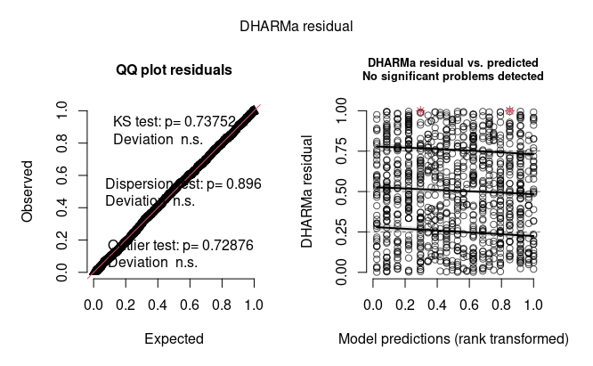
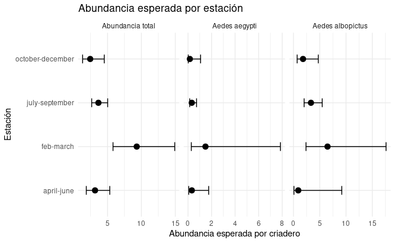
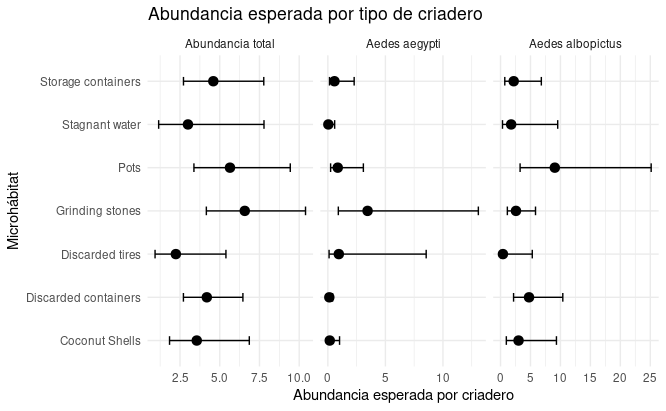

# Modelado de abundancia de mosquitos *Aedes* en criaderos urbanos de Bengaluru, India

## 1. Introducción

Dharmamuthuraja D, P. D. R, Lakshmi M. I, Isvaran K, Ghosh SK, Ishtiaq F (2023) Determinants of Aedes mosquito larval ecology in a heterogeneous urban environment- a longitudinal study in Bengaluru, India. PLoS Negl Trop Dis 17(11): e0011702. <https://doi.org/10.1371/journal.pntd.0011702>

Este paper analiza cómo el ambiente urbano influye en la presencia de mosquitos del género Aedes, en la ciudad de Bengaluru, India.

El trabajo permite identificar qué factores del entorno (lugar, recipientes con agua o la época del año) influyen en la aparición y cantidad de mosquitos. Además, considera tanto las características generales de la ciudad como los lugares específicos donde se acumula agua, lo que ayuda a entender mejor el problema.

Desde el punto de vista social, el estudio es importante porque muestra que muchos criaderos de mosquitos son generados por las personas, por ejemplo a través de recipientes o residuos con agua acumulada. Esto indica que el riesgo de dengue no depende solo de factores naturales, sino también de cómo está organizado el entorno urbano y de las prácticas de la población.

El estudio es de tipo observacional, ya que los investigadores no manipulan las variables, sino que registran lo que ocurre en el ambiente natural. Además, es un estudio longitudinal, porque se desarrolla a lo largo del tiempo (entre 2021 y 2022) para analizar cómo varía la presencia de mosquitos según la estación del año.

El muestreo se realizó mediante grillas distribuidas en la ciudad, que representan distintos tipos de ambientes, como zonas urbanas de distinta densidad, plantaciones, lagos y zonas baldías. Dentro de cada grilla se identificaron y analizaron los microhábitats (recipientes con agua) donde pueden desarrollarse las larvas.

------------------------------------------------------------------------

## 2. Cómo está compuesta la base

Los autores realizaron un muestreo sistemático de recipientes con agua distribuidos en diferentes sectores de la ciudad. Para cada criadero registraron características ambientales y físico-químicas, entre ellas el tipo de hábitat, el volumen de agua, la temperatura, el pH y otras variables relacionadas con las condiciones del sitio. Además, se cuantificó la cantidad de mosquitos emergidos y se identificaron las especies presentes, principalmente *Aedes aegypti* y *Aedes albopictus*.

La base de datos original contiene información de más de mil observaciones correspondientes a recipientes inspeccionados en distintos momentos del año. Cada registro representa un criadero individual y reúne tanto variables explicativas asociadas al ambiente como variables de respuesta relacionadas con la abundancia de mosquitos.

Debido a que el estudio fue realizado en diferentes estaciones del año y en distintos tipos de hábitats, la base permite explorar cómo las condiciones ambientales y las características de los criaderos se relacionan con la presencia y la abundancia de mosquitos. Asimismo, incluye una estructura jerárquica de muestreo, ya que varios criaderos fueron relevados dentro de las mismas celdas espaciales utilizadas por los autores para organizar el estudio.

En este informe se utiliza la base de datos del artículo como punto de partida para desarrollar un recorrido propio de análisis estadístico. El objetivo no es reproducir exactamente los resultados publicados, sino aprovechar la información disponible para explorar distintas estrategias de modelado y profundizar en la interpretación de los patrones observados en los datos.

------------------------------------------------------------------------

## 3. Análisis exploratorio

El análisis exploratorio se realizó siguiendo el protocolo propuesto por Zuur, con el objetivo de revisar la calidad de la base, conocer la distribución de las variables y detectar posibles problemas antes de avanzar con los modelos.

Primero se filtró la base para trabajar solo con criaderos activos, es decir, aquellos que tenían agua registrada (log volume \> 0), y con los datos longitudinales correspondientes a las grillas de tipo Index. Esta decisión fue importante porque los recipientes sin agua no representan criaderos activos y podían generar ceros que no correspondían al proceso biológico que nos interesaba modelar.

Para el análisis se seleccionaron tres variables respuesta de abundancia: abundancia total de mosquitos emergidos, abundancia de *Aedes aegypti* y abundancia de *Aedes albopictus*. Como variables explicativas se consideraron la estación del año, el microhábitat, el macrohábitat, la temperatura, el pH y el logaritmo del volumen de agua.

En la exploración inicial se observó que las variables de abundancia tenían una gran cantidad de ceros. Los valores fueron altos: aproximadamente 83% de ceros para la abundancia total, 92% para *Aedes aegypti* y 95% para *Aedes albopictus*. Esto mostró que el exceso de ceros era una característica central de los datos y no un detalle menor. Además, las distribuciones fueron muy asimétricas, con muchos valores en cero y pocos criaderos con abundancias altas.

Después se analizó la distribución de los valores positivos de abundancia. Esta mirada permitió observar mejor qué ocurría cuando efectivamente emergían mosquitos. Se encontraron diferencias entre estaciones y entre especies: la abundancia total mostró mayor dispersión en algunas estaciones, especialmente en feb–march y july–september. *Aedes aegypti* presentó un patrón parecido al total, mientras que *Aedes albopictus* mostró una distribución más concentrada y con presencia más marcada en april–june. Esto indicó que las especies no se comportan igual y que era conveniente modelarlas por separado.

Un punto importante fue la interpretación de los ceros. Como ya se habían eliminado los recipientes sin agua, los ceros restantes corresponden a criaderos con agua donde no emergieron mosquitos. Por eso no pueden considerarse simples errores o recipientes inactivos. Son ceros biológicamente relevantes, que pueden deberse a condiciones desfavorables del criadero o a variabilidad propia del proceso ecológico.

Luego se evaluó la colinealidad entre las variables continuas: temperatura, pH y log volume. Las correlaciones fueron bajas, menores a 0.3, y los valores de VIF estuvieron cerca de 1. Esto indicó que no había un problema importante de colinealidad, por lo que estas variables podían considerarse juntas en los modelos.

También se exploró la relación entre las abundancias y las variables ambientales. En general, las respuestas no mostraron patrones lineales simples. Las abundancias tendieron a concentrarse en ciertos rangos de temperatura y volumen, y los patrones no fueron iguales para las dos especies principales. Esto reforzó la idea de que los datos tenían una estructura compleja y que no era adecuado analizarlos con modelos lineales simples.

Por último, se revisó el supuesto de independencia. Las observaciones no son completamente independientes porque se tomaron múltiples mediciones dentro de una misma grilla, y cada grilla fue visitada en distintas estaciones del año. Esto genera una estructura agrupada de los datos, por lo que en el modelado posterior se consideró necesario incluir efectos aleatorios.

En conjunto, el análisis exploratorio mostró que los datos de abundancia son conteos, tienen exceso de ceros, fuerte asimetría y dependencia espacial o agrupada por grilla. Por eso, el AE orientó el análisis hacia modelos para conteos, especialmente binomial negativa, con posibilidad de incorporar inflación de ceros y estructura aleatoria.


**Figura 1. Proporción de ceros en las variables de abundancia.**

------------------------------------------------------------------------

## 4. Modelado de abundancia

A partir del análisis exploratorio, el paso siguiente fue ajustar modelos que fueran coherentes con el tipo de datos que teníamos. Las tres variables respuesta eran conteos: abundancia total de mosquitos emergidos, abundancia de *Aedes aegypti* y abundancia de *Aedes albopictus*.

### 4.1 Estrategia de modelado

El análisis se organizó en dos etapas. Primero comparamos distintas familias de modelos para decidir cuál representaba mejor los datos de abundancia. Se compararon tres opciones: Poisson, binomial negativa y binomial negativa inflada en ceros.

Después, una vez elegida la familia más adecuada, ajustamos modelos separados para macrohábitat y para microhábitat con condiciones internas del criadero.

El macrohábitat habla del ambiente urbano general donde está el criadero. El microhábitat y las condiciones internas hablan más directamente del recipiente y del agua donde se desarrollan las larvas.


**Figura 2: Estrategia de modelado**

### 4.2. Selección inicial de la familia de modelos

La comparación se hizo usando los mismos predictores y cambiando solo la familia del modelo. Esto nos permitió evaluar qué tipo de distribución representaba mejor la respuesta, sin mezclar esta decisión con cambios en las covariables.

La fórmula base usada para esta comparación fue:

`respuesta ~ Season + temp_std + pH_std + logvol_std + (1 | Grid_no)`

En los modelos inflados en ceros se agregó:

`ziformula = ~ Season`

Esto significa que la parte de inflación de ceros se modeló en función de la estación.

La parte condicional del modelo estima cuántos mosquitos se esperan en cada criadero. Esta parte también puede producir ceros, porque un criadero puede tener agua y aun así no producir mosquitos. La parte de inflación de ceros se agrega cuando aparecen más ceros de los que el modelo de conteo puede manejar bien.

### Comparación por AIC

La comparación inicial se hizo para las tres respuestas: abundancia total, *Aedes aegypti* y *Aedes albopictus*.

| Respuesta              | Poisson | Binomial negativa | ZINB |
|------------------------|---------|-------------------|------|
| Total mosquito emerged | 4123    | 1850              | 1804 |
| Aedes aegypti          | 2721    | 1067              | 1059 |
| Aedes albopictus       | 1329    | 584               | 568  |

Tabla 1. Comparación de las distintas familias de modelos

En las tres respuestas, el menor AIC correspondió al modelo binomial negativa inflado en ceros (ZINB). Esto indicó que, para estos datos, el modelo ZINB representaba mejor la combinación de sobredispersión y exceso de ceros. Por eso usamos esta familia de modelos para continuar el análisis.

### 4.3. Dos líneas de análisis: macrohábitat y microhábitat

Una vez elegida la familia ZINB, separamos el modelado en dos líneas.

La primera línea fue el modelo de macrohábitat. Este modelo pregunta si la abundancia cambia según el tipo de ambiente urbano o vecindario donde se encuentra el criadero. No intenta explicar el detalle del recipiente, sino el contexto general.

La estructura general fue:

```         
respuesta ~ Season + Macrohabitat + (1 | Grid_no)
ziformula = ~ Season
family = nbinom2
```

La segunda línea fue el modelo de microhábitat más condiciones del criadero. Este modelo mira el tipo de recipiente y las condiciones internas del agua: temperatura, pH y volumen transformado.

La estructura general fue:

```         
respuesta ~ Season + Microhabitat + temp_std + pH_std + logvol_std + (1 | Grid_no)
ziformula = ~ Season
family = nbinom2
```

El modelo de macrohábitat no incluye temperatura, pH ni volumen, porque esas variables describen condiciones medidas dentro del criadero. Por eso las analizamos en la línea de microhábitat.

### 4.4. Efecto aleatorio por grilla

En los modelos se incluyó `Grid_no` como efecto aleatorio:

```         
(1 | Grid_no)
```

La razón es que las observaciones no son completamente independientes. Varios criaderos pertenecen a una misma grilla y pueden compartir condiciones espaciales o ambientales. Entonces, el efecto aleatorio permite representar esa estructura agrupada.

En algunos modelos la varianza asociada a `Grid_no` fue muy baja. Aun así, su inclusión tuvo sentido porque responde al diseño del muestreo.

### 4.5. Diagnóstico e interpretación

Después de ajustar cada modelo revisamos los residuos con DHARMa. Esta revisión fue necesaria porque no alcanza con mirar solo el AIC. Un modelo puede tener buen AIC y aun así mostrar problemas en los residuos.

Luego interpretamos los modelos usando dos herramientas:

-   `summary()`, para revisar coeficientes, dirección de los efectos y significancia;

-   `emmeans`, para obtener medias estimadas y contrastes en una escala más fácil de interpretar.

Esto fue importante porque los modelos usan enlace log. Entonces, los coeficientes del `summary()` están en escala logarítmica. Para comunicar los resultados de forma más clara, usamos medias esperadas, razones entre medias e intervalos de confianza.

------------------------------------------------------------------------

## 5. Diagnóstico de modelos

Luego del ajuste de los seis modelos finales, revisamos los residuos simulados con DHARMa.

Como se ajustaron seis modelos, en el informe resumimos los diagnósticos en una tabla general y la siguiente figura muestra un diagnóstico representativo. En este caso se trata del diagnóstico del modelo Macrohabitat para la abundancia total.

Los gráficos completos de residuos se dejan en QMD del modelado de abundancia incluido en el anexo del informe.



**Figura 3: Diagnóstico con DHARMa del modelo macrohabitat de abundancia total**

### Tabla resumen de diagnósticos por DHARMa de los 6 modelos

| Respuesta | Modelo | Uniformidad | Dispersión | Exceso de ceros | Lectura general |
|----|----|----|----|----|----|
| Total | Macro | ok | ok | ok | ajuste razonable |
| Total | Micro + ambiente | ok | ok | ok | ajuste razonable |
| *Aedes aegypti* | Macro | ok | ok | ok | ajuste razonable |
| *Aedes aegypti* | Micro + ambiente | ok | leve señal / ok | ok | ajuste aceptable |
| *Aedes albopictus* | Macro | ok | ok | ok | ajuste razonable |
| *Aedes albopictus* | Micro + ambiente | ok | ok | ok | ajuste razonable |

Tabla 2: Resumen de los diagnósticos por DHARMa de los 6 modelos

En términos generales, los diagnósticos no mostraron problemas suficientemente graves como para descartar la estrategia de modelado elegida. Por eso continuamos con la interpretación de los modelos ZINB.

# 6. Resultados principales

Una vez ajustados y diagnosticados los modelos, el paso siguiente fue interpretar los resultados en una escala más clara. Los `summary()` de los modelos permiten revisar coeficientes, dirección de los efectos y significancia, pero esos coeficientes están en escala logarítmica. Por eso no son la forma más directa de comunicar los resultados.

Para facilitar la interpretación usamos **emmeans**, que permite obtener medias estimadas en escala de respuesta. En este caso, las estimaciones se interpretan como abundancia esperada de mosquitos emergidos por criadero.

Nos enfocamos en dos preguntas aplicadas:

1.  ¿En qué estación se espera mayor abundancia de mosquitos?
2.  ¿En qué tipo de microhábitat se espera mayor abundancia?

Estas preguntas son útiles porque permiten pasar del modelo estadístico a una lectura ecológica y sanitaria: cuándo aparecen más mosquitos y qué tipos de criaderos podrían ser más productivos.

### 6.1 Abundancia esperada por estación y especie



**Figura 4: Abundancia esperada por estación y especie**

La abundancia esperada por estación mostró que el patrón más claro aparece en la abundancia total y en *Aedes aegypti*. En ambos casos, `feb-march` presentó los valores esperados más altos.

En *Aedes albopictus*, el patrón estacional fue menos claro. Esto coincide con lo observado en los modelos: al separar por especie aumenta la proporción de ceros y las estimaciones se vuelven más inciertas.

Este resultado indica que la estación parece ser un factor importante para la abundancia total y para *Aedes aegypti*, pero no se observa con la misma claridad en *Aedes albopictus*.

### 6.2 Abundancia esperada por microhábitat y especie



**Figura 5: Abundancia esperada por Microhabitat y especie**

Al analizar los microhábitats, el resultado más marcado aparece en *Aedes aegypti*. En esta especie, **Grinding stones** presentó la mayor abundancia esperada.

Para la abundancia total, las diferencias entre microhábitats fueron menos claras. En *Aedes albopictus* tampoco apareció un microhábitat claramente dominante, aunque algunas categorías mostraron valores más altos con mayor incertidumbre.

Este gráfico es importante porque permite identificar tipos concretos de criaderos que podrían ser más relevantes para la producción de mosquitos.

### Variables ambientales

Además de estación y microhábitat, los modelos incluyeron temperatura, pH y volumen transformado. Estos efectos no fueron iguales para todas las respuestas.

| Respuesta          | Temperatura      | pH               | Volumen          |
|--------------------|------------------|------------------|------------------|
| Abundancia total   | Efecto negativo  | Sin efecto claro | Sin efecto claro |
| *Aedes aegypti*    | Sin efecto claro | Sin efecto claro | Sin efecto claro |
| *Aedes albopictus* | Sin efecto claro | Efecto positivo  | Efecto negativo  |

**Tabla 3: Resumen de resultados de variables ambientales del microhabitat**

Para la abundancia total, la temperatura mostró un efecto negativo. Para *Aedes aegypti*, ninguna de las variables ambientales mostró un efecto claro. Para *Aedes albopictus*, el pH mostró un efecto positivo y el volumen un efecto negativo.

Esto indica que las variables ambientales no tuvieron un patrón único para todas las respuestas.

------------------------------------------------------------------------

## 7. Conclusiones del modelado de abundancia

El modelado permitió analizar la abundancia de mosquitos en tres niveles: abundancia total, abundancia de *Aedes aegypti* y abundancia de *Aedes albopictus*. En los tres casos se trabajó con modelos binomiales negativos inflados en ceros, porque el análisis exploratorio mostró dos problemas importantes: sobredispersión y una alta proporción de ceros.

A lo largo del análisis usamos primero los `summary()` para revisar la dirección de los efectos y detectar qué variables parecían más importantes. Después resumimos esos resultados en una tabla comparativa y finalmente usamos `emmeans` para pasar a una escala más clara: abundancias esperadas por estación, especie y tipo de criadero.

### Abundancia total

En la abundancia total, el patrón más claro fue estacional. La mayor abundancia esperada apareció en `feb-march`. Esto indica que, según el modelo, ese período concentra una mayor producción esperada de mosquitos emergidos.

A nivel de macrohábitat, `Lake` apareció asociado con menor abundancia total. Sin embargo, para una lectura aplicada, el resultado más útil parece ser el patrón estacional, porque permite identificar un momento del año donde podría esperarse mayor abundancia.

En el modelo de microhábitat y condiciones internas, no aparecieron diferencias claras entre tipos de microhábitat para la abundancia total. Entre las variables ambientales, la temperatura mostró un efecto negativo: a mayor temperatura estandarizada, menor abundancia esperada total. Este resultado debe interpretarse dentro del modelo, porque no necesariamente significa que la temperatura por sí sola explique toda la dinámica de abundancia.

### *Aedes aegypti*

En *Aedes aegypti* también apareció una señal estacional importante. Al igual que en la abundancia total, `feb-march` mostró mayor abundancia esperada. Esto es relevante porque *Aedes aegypti* es una de las especies de mayor interés sanitario.

En el modelo de macrohábitat, `Lake` mostró menor abundancia esperada de *Aedes aegypti*. Pero el resultado más importante apareció al mirar los microhábitats: `Grinding stones` fue el tipo de criadero con mayor abundancia esperada para esta especie.

Este resultado es útil desde una mirada aplicada, porque no solo indica una estación de mayor abundancia, sino también un tipo concreto de criadero que podría ser más productivo para *Aedes aegypti*. De todos modos, como el efecto estimado fue muy grande, conviene interpretarlo con cautela y revisarlo junto con la distribución de los datos.

En este modelo, temperatura, pH y volumen no mostraron efectos claros para *Aedes aegypti*. También se observó que el efecto aleatorio de `Grid_no` tuvo mayor peso que en otros modelos, lo que indica que algunas diferencias entre grillas siguieron siendo importantes aun después de considerar estación, microhábitat y condiciones del criadero.

### *Aedes albopictus*

En *Aedes albopictus*, los patrones fueron menos claros que en la abundancia total y en *Aedes aegypti*. Las estaciones no mostraron diferencias fuertes en la abundancia esperada, y tampoco apareció un microhábitat claramente dominante.

En el modelo de macrohábitat, `High dense` mostró menor abundancia esperada. En el modelo de microhábitat y condiciones internas, los resultados más claros aparecieron en las variables ambientales: el pH tuvo un efecto positivo y el volumen un efecto negativo.

Esto sugiere que, para *Aedes albopictus*, las condiciones internas del criadero podrían ser más informativas que la estación o el tipo de microhábitat. Sin embargo, esta interpretación debe hacerse con más cuidado, porque esta especie tuvo muchos ceros y menos registros positivos que la abundancia total.

### Lectura general

En conjunto, el resultado más claro del modelado es que la abundancia total y *Aedes aegypti* muestran un patrón estacional marcado, con mayor abundancia esperada en `feb-march`. Además, *Aedes aegypti* mostró una asociación fuerte con `Grinding stones`, lo que puede señalar un tipo de criadero especialmente importante.

Para *Aedes albopictus*, el patrón fue más incierto. No se observó una señal estacional fuerte ni un microhábitat claramente dominante, pero sí aparecieron señales asociadas al pH y al volumen.

La parte de inflación de ceros fue importante para mejorar el ajuste de los modelos, porque los datos tenían muchos ceros. Sin embargo, no la tomamos como eje principal de las conclusiones aplicadas. Para responder las preguntas del trabajo priorizamos la parte condicional del modelo, que estima la abundancia esperada de mosquitos.

Este recorrido muestra que la abundancia total permite ver el patrón general, pero que separar por especie aporta información más específica. Al mismo tiempo, al separar por especie aumentan los ceros y la incertidumbre, por lo que las conclusiones sobre *Aedes aegypti* y especialmente sobre *Aedes albopictus* deben leerse con más cautela.

# 8. Anexos

El informe principal resume el recorrido y los resultados más importantes del análisis. Para no sobrecargar el texto con salidas extensas de código, gráficos exploratorios y explicaciones técnicas, dejamos como anexos los documentos de trabajo que respaldan cada etapa del análisis.

-   **Anexo 1. Análisis exploratorio siguiendo la lógica de Zuur**\
    <https://github.com/arielmpereira/bioestadistica-aedes/blob/main/AE_Zuur.pdf>

-   **Anexo 2. Modelado de abundancia**\
    <https://github.com/arielmpereira/bioestadistica-aedes/blob/main/modelado_abundancia_aedes_v3.pdf>

-   **Anexo 3. Interpretación completa de los summaries de los seis modelos**\
    <https://github.com/arielmpereira/bioestadistica-aedes/blob/main/Anexo%20A%20interpretacion%20modelos.md>

-   **Anexo 4. Comprendiendo ceros falsos, estructurales y aleatorios en ecología**\
    <https://github.com/arielmpereira/bioestadistica-aedes/blob/main/modelos_exceso_ceros.md>

-   **Anexo 5. Tutorial de emmeans**\
    <https://github.com/arielmpereira/bioestadistica-aedes/blob/main/Tutorial%20emmeans.pdf>

-   **Anexo 6. Entendiendo DHARMa**\
    <https://github.com/arielmpereira/bioestadistica-aedes/blob/main/Entendiendo_dharma.md>
