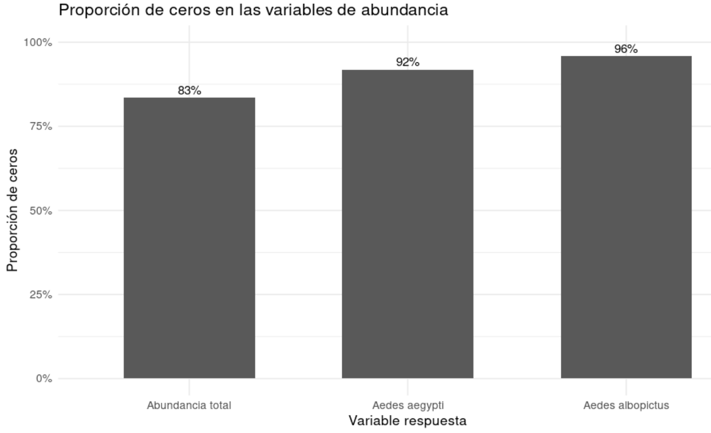
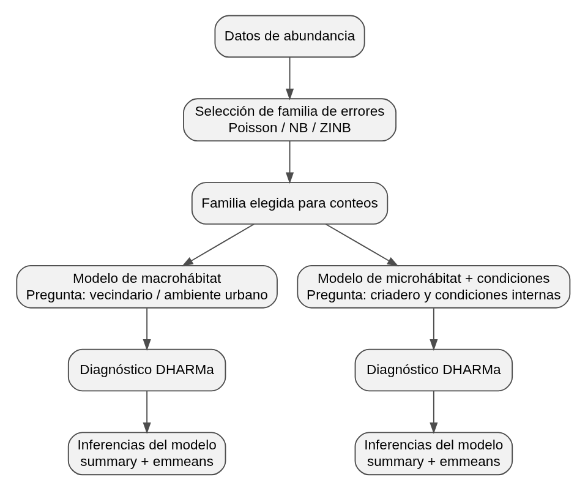

# Modelado de abundancia de mosquitos *Aedes* en criaderos urbanos de Bengaluru, India

## 1. Introducción

Dharmamuthuraja D, P. D. R, Lakshmi M. I, Isvaran K, Ghosh SK, Ishtiaq F (2023) Determinants of Aedes mosquito larval ecology in a heterogeneous urban environment- a longitudinal study in Bengaluru, India. PLoS Negl Trop Dis 17(11): e0011702. <https://doi.org/10.1371/journal.pntd.0011702>

Este paper analiza cómo el ambiente urbano influye en la presencia de mosquitos del género Aedes, en la ciudad de Bengaluru, India.

El trabajo permite identificar qué factores del entorno (lugar, recipientes con agua o la época del año) influyen en la aparición y cantidad de mosquitos. Además, considera tanto las características generales de la ciudad como los lugares específicos donde se acumula agua, lo que ayuda a entender mejor el problema.

Desde el punto de vista social, el estudio es importante porque muestra que muchos criaderos de mosquitos son generados por las personas, por ejemplo a través de recipientes o residuos con agua acumulada. Esto indica que el riesgo de dengue no depende solo de factores naturales, sino también de cómo está organizado el entorno urbano y de las prácticas de la población.

El estudio es de tipo observacional, ya que los investigadores no manipulan las variables, sino que registran lo que ocurre en el ambiente natural. Además, es un estudio longitudinal, porque se desarrolla a lo largo del tiempo (entre 2021 y 2022) para analizar cómo varía la presencia de mosquitos según la estación del año.

El muestreo se realizó mediante grillas distribuidas en la ciudad, que representan distintos tipos de ambientes, como zonas urbanas de distinta densidad, plantaciones, lagos y zonas baldías. Dentro de cada grilla se identificaron y analizaron los microhábitats (recipientes con agua) donde pueden desarrollarse las larvas.

------------------------------------------------------------------------

## 2. Como está compuesta la base

Los autores realizaron un muestreo sistemático de recipientes con agua distribuidos en diferentes sectores de la ciudad. Para cada criadero registraron características ambientales y fisico-químicas, entre ellas el tipo de hábitat, el volumen de agua, la temperatura, el pH y otras variables relacionadas con las condiciones del sitio. Además, se cuantificó la cantidad de mosquitos emergidos y se identificaron las especies presentes, principalmente *Aedes aegypti* y *Aedes albopictus*.

La base de datos original contiene información de más de mil observaciones correspondientes a recipientes inspeccionados en distintos momentos del año. Cada registro representa un criadero individual y reúne tanto variables explicativas asociadas al ambiente como variables de respuesta relacionadas con la abundancia de mosquitos.

Debido a que el estudio fue realizado en diferentes estaciones del año y en distintos tipos de hábitats, la base permite explorar cómo las condiciones ambientales y las características de los criaderos se relacionan con la presencia y la abundancia de mosquitos. Asimismo, incluye una estructura jerárquica de muestreo, ya que varios criaderos fueron relevados dentro de las mismas celdas espaciales utilizadas por los autores para organizar el estudio.

En este informe se utiliza la base de datos del artículo como punto de partida para desarrollar un recorrido propio de análisis estadístico. El objetivo no es reproducir exactamente los resultados publicados, sino aprovechar la información disponible para explorar distintas estrategias de modelado y profundizar en la interpretación de los patrones observados en los datos.

------------------------------------------------------------------------

## 3. Análisis exploratorio

El análisis exploratorio se realizó siguiendo el protocolo propuesto por Zuur, con el objetivo de revisar la calidad de la base, conocer la distribución de las variables y detectar posibles problemas antes de avanzar con los modelos.

Primero se filtró la base para trabajar solo con criaderos activos, es decir, aquellos que tenían agua registrada (log volume \> 0), y con los datos longitudinales correspondientes a las grillas de tipo Index. Esta decisión fue importante porque los recipientes sin agua no representan criaderos activos y podían generar ceros que no correspondían al proceso biológico que nos interesaba modelar.

Para el análisis se seleccionaron tres variables respuesta de abundancia: abundancia total de mosquitos emergidos, abundancia de *Aedes aegypti* y abundancia de *Aedes albopictus*. Como variables explicativas se consideraron la estación del año, el microhábitat, el macrohábitat, la temperatura, el pH y el logaritmo del volumen de agua.

En la exploración inicial se observó que las variables de abundancia tenían una gran cantidad de ceros. Los valores fueron altos: aproximadamente 83% de ceros para la abundancia total, 92% para *Aedes aegypti* y 95% para *Aedes albopictus*. Esto mostró que el exceso de ceros era una característica central de los datos y no un detalle menor. Además, las distribuciones fueron muy asimétricas, con muchos valores en cero y pocos criaderos con abundancias altas.

Después se analizó la distribución de los valores positivos de abundancia. Esta mirada permitió observar mejor qué ocurría cuando efectivamente emergían mosquitos. Se encontraron diferencias entre estaciones y entre especies: la abundancia total mostró mayor dispersión en algunas estaciones, especialmente en feb–march y july–september. *Aedes aegypti* presentó un patrón parecido al total, mientras que *Aedes albopictus* mostró una distribución más concentrada y con presencia más marcada en april–june. Esto indicó que las especies no se comportan igual y que era conveniente modelarlas por separado.

Un punto importante fue la interpretación de los ceros. Como ya se habían eliminado los recipientes sin agua, los ceros restantes corresponden a criaderos con agua donde no emergieron mosquitos. Por eso no pueden considerarse simples errores o recipientes inactivos. Son ceros biológicamente relevantes, que pueden deberse a condiciones desfavorables del criadero o a variabilidad propia del proceso ecológico.

Luego se evaluó la colinealidad entre las variables continuas: temperatura, pH y log volume. Las correlaciones fueron bajas, menores a 0.3, y los valores de VIF estuvieron cerca de 1. Esto indicó que no había un problema importante de colinealidad, por lo que estas variables podían considerarse juntas en los modelos.

También se exploró la relación entre las abundancias y las variables ambientales. En general, las respuestas no mostraron patrones lineales simples. Las abundancias tendieron a concentrarse en ciertos rangos de temperatura y volumen, y los patrones no fueron iguales para las dos especies principales. Esto reforzó la idea de que los datos tenían una estructura compleja y que no era adecuado analizarlos con modelos lineales simples.

Por último, se revisó el supuesto de independencia. Las observaciones no son completamente independientes porque se tomaron múltiples mediciones dentro de una misma grilla, y cada grilla fue visitada en distintas estaciones del año. Esto genera una estructura agrupada de los datos, por lo que en el modelado posterior se consideró necesario incluir efectos aleatorios.

En conjunto, el análisis exploratorio mostró que los datos de abundancia son conteos, tienen exceso de ceros, fuerte asimetría y dependencia espacial o agrupada por grilla. Por eso, el AE orientó el análisis hacia modelos para conteos, especialmente binomial negativa, con posibilidad de incorporar inflación de ceros y estructura aleatoria.



**Figura 1. Proporción de ceros en las variables de abundancia**

------------------------------------------------------------------------

## 4. Modelado de abundancia

A partir del análisis exploratorio, el paso siguiente fue ajustar modelos que fueran coherentes con el tipo de datos que teníamos. Las tres variables respuesta eran conteos: abundancia total de mosquitos emergidos, abundancia de *Aedes aegypti* y abundancia de *Aedes albopictus*.

### 4.1 Estrategia de modelado

El análisis se organizó en dos etapas. Primero comparamos distintas familias de modelos para decidir cuál representaba mejor los datos de abundancia. Se compararon tres opciones: Poisson, binomial negativo y binomial negativo inflado en ceros.

Después, una vez elegida la familia más adecuada, ajustamos modelos separados para macrohábitat y para microhábitat con condiciones internas del criadero.

El macrohábitat habla del ambiente urbano general donde está el criadero. El microhábitat y las condiciones internas hablan más directamente del recipiente y del agua donde se desarrollan las larvas.



**Figura 2: Estrategía de modelado**

### 4.2. Selección inicial de la familia de modelos

La comparación se hizo usando los mismos predictores y cambiando solo la familia del modelo. Esto nos permitió evaluar qué tipo de distribución representaba mejor la respuesta, sin mezclar esta decisión con cambios en las covariables.

La fórmula base usada para esta comparación fue:

respuesta \~ Season + temp_std + pH_std + logvol_std + (1 \| Grid_no)

En los modelos inflados en ceros se agregó:

ziformula = \~ Season

Esto significa que la parte de inflación de ceros se modeló en función de la estación.

La parte condicional del modelo estima cuántos mosquitos se esperan en cada criadero. Esta parte también puede producir ceros, porque un criadero puede tener agua y aun así no producir mosquitos. La parte de inflación de ceros se agrega cuando aparecen más ceros de los que el modelo de conteo puede manejar bien.

#### Comparación por AIC

La comparación inicial se hizo para las tres respuestas: abundancia total, *Aedes aegypti* y *Aedes albopictus*.

| Respuesta              | Poisson | Binomial negativa | ZINB |
|------------------------|---------|-------------------|------|
| Total mosquito emerged | 4123    | 1850              | 1804 |
| Aedes aegypti          | 2721    | 1067              | 1059 |
| Aedes albopictus       | 1329    | 584               | 568  |

Tabla 1. Comparación de distintas familas de modelos

Los modelos binomiales negativos inflados en ceros tuvieron el menor AIC en las tres respuestas. Por eso, para continuar el análisis usamos modelos ZINB.

### 4.3. Dos líneas de análisis: macrohábitat y microhábitat

Una vez elegida la familia ZINB, separamos el modelado en dos líneas.

La primera línea fue el modelo de macrohábitat. Este modelo pregunta si la abundancia cambia según el tipo de ambiente urbano o vecindario donde se encuentra el criadero. No intenta explicar el detalle del recipiente, sino el contexto general.

La estructura general fue:

```         
respuesta ~ Season + Macrohabitat + (1 | Grid_no)
ziformula = ~ Season
family = nbinom2
```

La segunda línea fue el modelo de microhábitat más condiciones del criadero. Este modelo mira el tipo de recipiente y las condiciones internas del agua: temperatura, pH y volumen transformado.

La estructura general fue:

```         
respuesta ~ Season + Microhabitat + temp_std + pH_std + logvol_std + (1 | Grid_no)
ziformula = ~ Season
family = nbinom2
```

En esta versión, el modelo de macrohábitat no incluye temperatura, pH ni volumen, porque esas variables describen condiciones medidas dentro del criadero. Por eso las analizamos en la línea de microhábitat.

### 4.4. Efecto aleatorio por grilla

En los modelos se incluyó `Grid_no` como efecto aleatorio:

```         
(1 | Grid_no)
```

La razón es que las observaciones no son completamente independientes. Varios criaderos pertenecen a una misma grilla y pueden compartir condiciones espaciales o ambientales. Entonces, el efecto aleatorio permite representar esa estructura agrupada.

En algunos modelos la varianza asociada a `Grid_no` fue muy baja. Aun así, su inclusión tuvo sentido porque responde al diseño del muestreo.

## 5. Diagnóstico de modelos

## 6. Resultados principales

## 7. Conclusión
